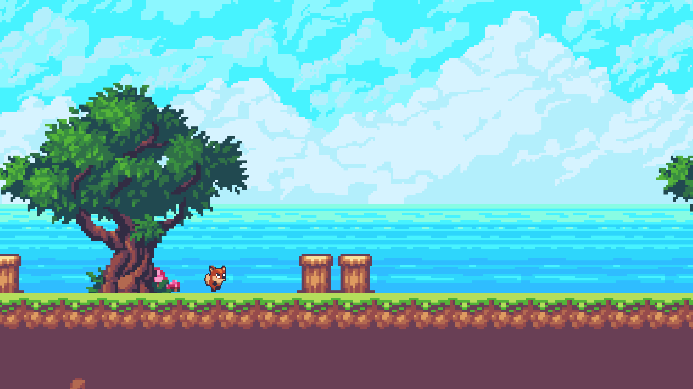

# Geometry Dash clone

This is a simple clone of [Geometry Dash](https://store.steampowered.com/app/322170/Geometry_Dash/)
in Unity. This clone does not try to clone Geometry Dash design and aesthetics, but focuses only
on the gameplay.

## Screenshots

More screenshots can be found in `./screenshots/`.

## Installation

The simplest way to play is to follow these steps.

1. Go to [Releases page](https://github.com/PatrikTrefil/geometry-dash-clone/releases).
2. Download the build for your platform.
3. Enjoy.

Other alternatives are described in the [User guide section of the wiki](https://github.com/PatrikTrefil/geometry-dash-clone/wiki/User-guide).

**More information about this project can be found in the [Github wiki](https://github.com/PatrikTrefil/geometry-dash-clone/wiki).**
